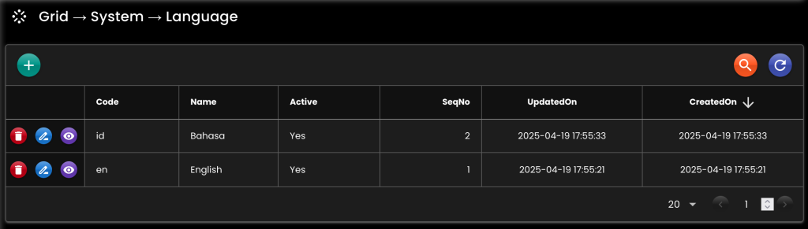
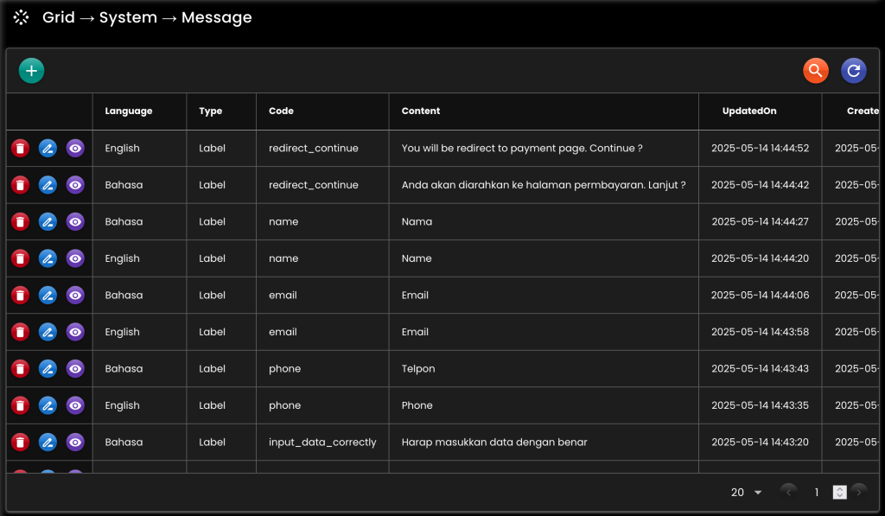

[__Ideahut Spring Boot__](./index.md)  

# Message

- Menangani pesan text dalam banyak bahasa.
- Untuk _RedisMessageHandler_ akan dikombinasikan dengan data yang tersimpan di database.

## Bean

``` java
// Redis
@Bean
MessageHandler messageHandler(
    AppProperties appProperties,
    DataMapper dataMapper,
    EntityTrxManager entityTrxManager,
    RedisTemplate<String, byte[]> redisTemplate
) {
    MessageDefinition message = appProperties.getMessage();
    return new RedisMessageHandler()
    .setDataMapper(dataMapper)
    .setDefaultLanguage(message.getDefaultLanguage())
    .setEntityClass(null)
    .setEntityTrxManager(entityTrxManager)
    .setLimitReloadData(message.getLimitReloadData())
    .setMaxReloadThread(message.getMaxReloadThread())
    .setRedisParam(
        new RedisParam<String, byte[]>(message.getRedisParam())
        .setRedisTemplate(redisTemplate)
    );
}

// Resource
@Bean
MessageHandler messageHandler(
    AppProperties appProperties
) {
    MessageDefinition message = appProperties.getMessage();
    SessionLocaleResolver localeResolver = new SessionLocaleResolver();
    localeResolver.setDefaultLocale(new Locale(message.getDefaultLanguage()));
    ResourceBundleMessageSource messageSource = new ResourceBundleMessageSource();
    messageSource.setAlwaysUseMessageFormat(false);
    messageSource.setBasenames(message.getBasenames().toArray(new String[0]));
    messageSource.setDefaultEncoding(message.getDefaultEncoding());
    messageSource.setFallbackToSystemLocale(message.getFallbackToSystemLocale());
    messageSource.setCacheSeconds(message.getCacheSeconds());
    messageSource.setUseCodeAsDefaultMessage(message.getUseCodeAsDefaultMessage());
    return new ResourceBundleMessageHandler()
    .setLocaleResolver(localeResolver)
    .setMessageSource(messageSource);
}
```

## Screenshot

<div>
   
</div>
<br/>
<div>
   
</div>

##

[__Ideahut Spring Boot__](./index.md)  
