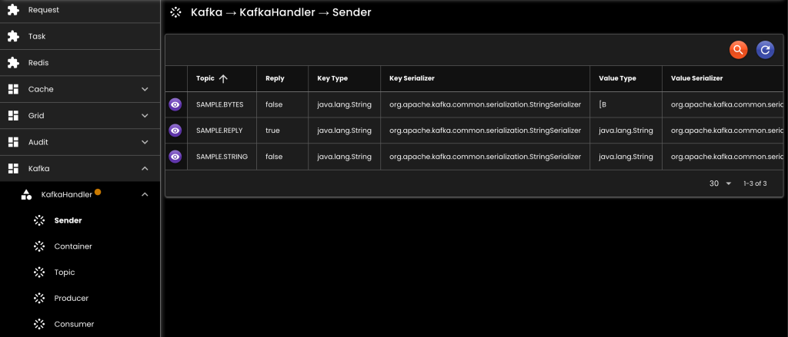
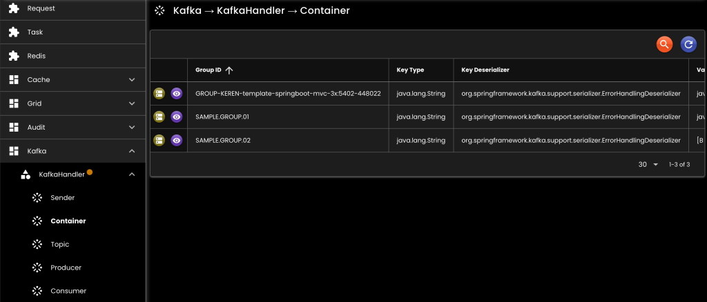
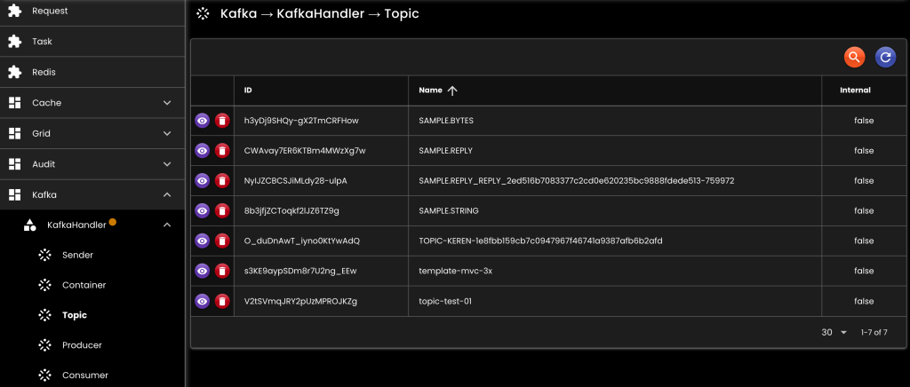
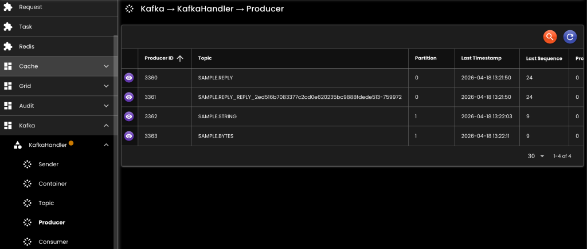

[__Ideahut Spring Boot__](./index.md)  

# Kafka
- Untuk menangani _topic_, _producer_, dan _consumer_ kafka.
- Satu KafkaHandler akan menangani hanya satu server kafka.
- KafkaSenderReceiver adalah _sender_ yang menunggu hasil dari _consumer_.

```java
public interface KafkaHandler {
	// Untuk mendapatkan KafkaSender
	<K, V> KafkaSender<K, V> getStaticSender(String topic);
	<K, V, R> KafkaSenderReceiver<K, V, R> getStaticSenderReceiver(String topic);
	
	// Membuat KafkaSender dinamis yang akan mengikuti perubahan KafkaProperties
	<K, V> KafkaSender<K, V> createDynamicSender(String topic);
	<K, V, R> KafkaSenderReceiver<K, V, R> createDynamicSenderReceiver(String topic);
}

public interface KafkaManager {
	Long timestamp(); // waktu terakhir properties di-load
	KafkaProperties properties();
	AdminClient admin();
	KafkaProducerBase producer();
	KafkaConsumerBase consumer();
}
```

## Bean

``` java
@Bean
KafkaHandler kafkaHandler(
	AppProperties appProperties,
	BinarySerializer binarySerializer
) {
	KafkaDefinition kafka = appProperties.getKafka().getMessaging();
	return new KafkaHandlerImpl()
	.setBinarySerializer(binarySerializer)
	.setConfigurationFile(kafka.getConfigurationFile())
	.setProperties(kafka.getProperties());
}
```

- `setBinarySerializer`: [BinarySerializer](./05-binary.md) bean.
- `setProperties`: Kafka properties, atau bisa juga menggunakan configuration file.
- `setConfigurationFile`: Kafka properties yang disimpan ke file, [contoh file](./assets/kafka.yaml).

## Screenshot

<div>
   
</div>
<br/>
<div>
   
</div>
<br/>
<div>
   
</div>
<br/>
<div>
   
</div>
<br/>
<div>
   
</div>

##

[__Ideahut Spring Boot__](./index.md)  
